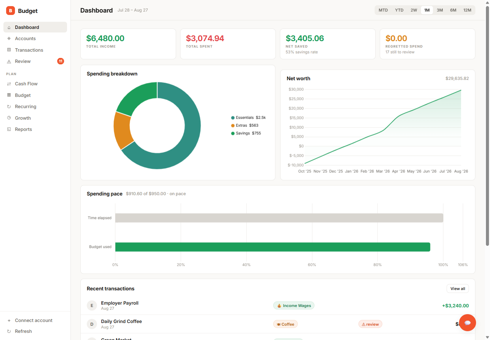
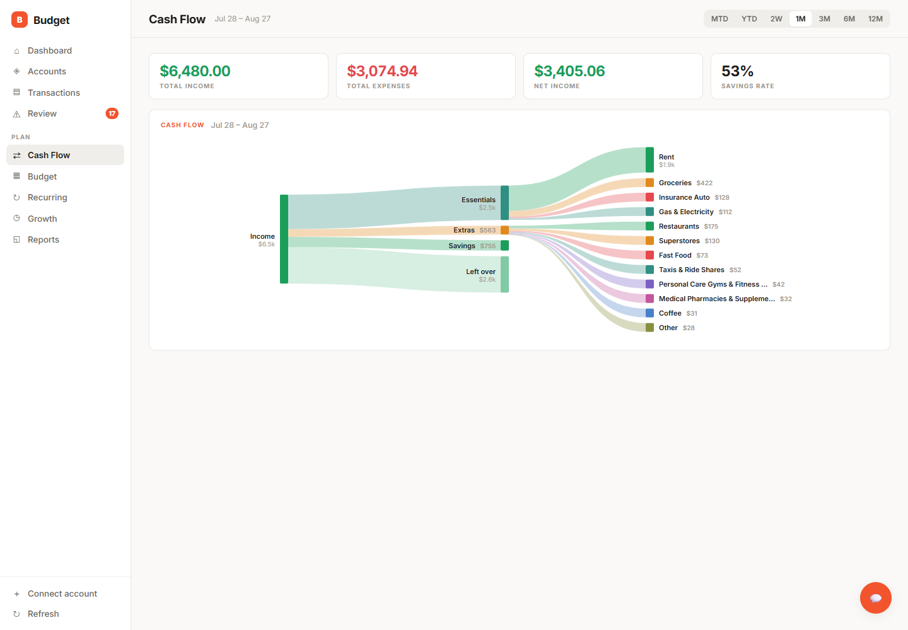
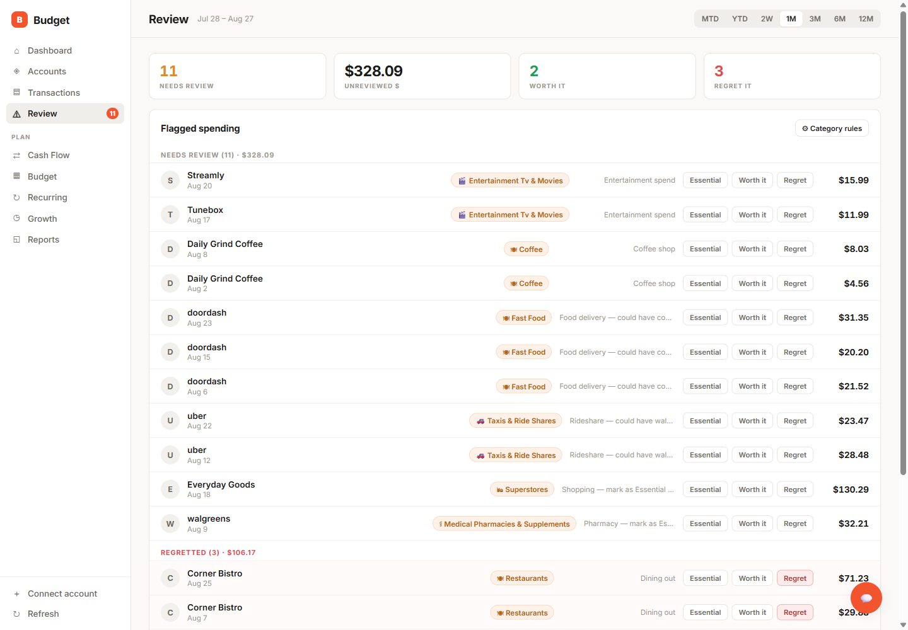
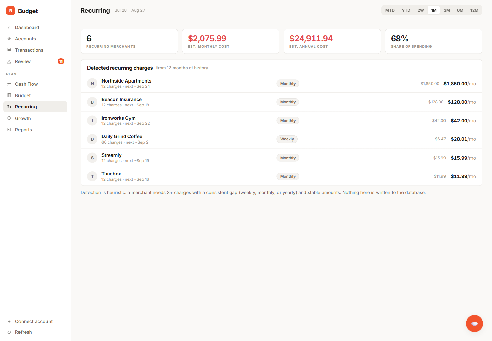
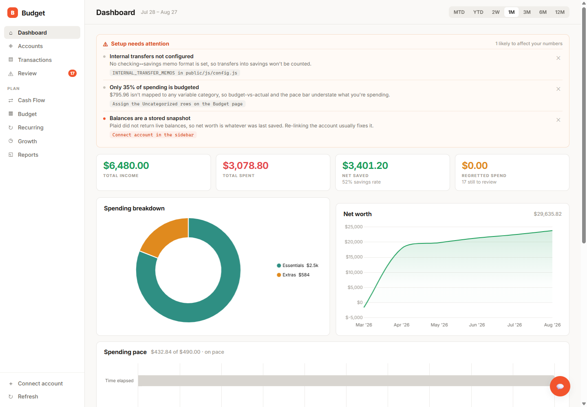

# Budget

A self-hosted personal budgeting dashboard. Links real bank accounts through
[Plaid](https://plaid.com), classifies every transaction, and tracks spend against a
budget you define. Runs entirely on your own machine — no hosted component, no account,
no data leaving your box except the calls to Plaid.



## What it does

- **Live balances** across checking, savings, and credit cards, with net worth as
  `checking + savings − credit`, plus a month-over-month delta.
- **Automatic classification** of every transaction into essential / extra / savings /
  income. Internal transfers and credit-card bill payments are netted out so they never
  show up as spending.
- **Cash flow** — where income actually went, as a Sankey.
- **Budget tracking** — fixed monthly constants plus variable categories mapped to Plaid
  category prefixes, matched longest-prefix-first so nothing double counts.
- **Recurring charges** detected from 12 months of history: cadence, amount, next
  expected date, and what it costs per month.
- **Lazy-spending review** — flags discretionary purchases and asks for a verdict, then
  charts what the regretted spend would have compounded to.
- **Growth projection** with savings goals and time-to-target.
- **Ask Claude** — an optional chat panel that answers questions against the dashboard's
  current data snapshot.

### Cash flow

Income on the left, categories on the right. The buckets are the same ones the rest of
the app uses, so the totals always agree with the dashboard.



### The review queue

The opinionated part. Discretionary purchases get flagged with a reason, and you give
each one a verdict: **Essential** (promote it out of discretionary), **Worth it**, or
**Regret it**. Verdicts persist, and every regret figure in the app — the pie, the
stats, the growth what-if — is driven by them.



### Recurring charges

Heuristic detection over your own history: a merchant needs three or more charges at a
consistent interval with stable amounts. Streams that have gone quiet for two cycles are
marked stopped and excluded from the totals.



## Setup

Requires **Node.js 20+** (`better-sqlite3` is a native module and does not build on 18).

```bash
npm install
cp .env.example .env    # then fill in your Plaid credentials
npm start
```

Open <http://localhost:3000> and use **Connect account** to link an account.

`PLAID_ENV=sandbox` works immediately with Plaid's test credentials. Linking real banks
requires production access, which Plaid grants per-account on request.

## Configure it for your accounts — do this first

**`public/js/config.js` is the file to edit.** The defaults are deliberately empty where
a wrong guess would silently produce wrong numbers, so a fresh clone is under-configured
on purpose. The dashboard tells you what is missing rather than pretending:



The two that matter most:

- **`RENT_MERCHANTS`** — rent paid by ACH or Zelle usually isn't tagged
  `RENT_AND_UTILITIES_RENT` by Plaid, and the P2P rules would otherwise skip it. Left
  empty, your largest monthly expense can vanish from spending entirely.
- **`INTERNAL_TRANSFER_MEMOS`** — a transfer between your own accounts appears twice,
  once per account. Banks label the two legs differently and there is no standard. Left
  empty is safe but lossy: "Transferred to savings" reads zero. Getting `checkingSide`
  and `savingsSide` **backwards is not safe** — you would count the wrong leg.

Also worth a look: `ESSENTIAL_CATS` (which Plaid categories you consider needs),
`SAVINGS_MERCHANTS` (your brokerages), `ESSENTIAL_MERCHANTS` (your insurer), and
`ONE_OFF_INCOME_MIN`. Rules that apply to everyone live in `public/js/rules.js` and
should rarely need editing.

## Data and privacy

This app reads your bank transactions. Before you run it:

- **Everything stays local.** Transactions are fetched from Plaid on demand and held in
  the browser. Only your budget definitions, savings goals, balance snapshots, and
  spending verdicts persist, to a local SQLite file (`budget.db`).
- **`budget.db`, `.env`, and `.tokens.json` are gitignored and must stay that way.**
  `.tokens.json` holds Plaid *access tokens* — long-lived read credentials for your
  linked accounts. If one leaks, revoke it with Plaid's `/item/remove`; rotating your API
  secret alone is not enough.
- **There is no authentication.** Three things keep that from being a hole, and all
  three matter:
  1. **No CORS grant.** The dashboard is same-origin, so it never needs one — and
     without one, no other site you visit can read your data off localhost.
  2. **A `Host` allowlist.** Binding to loopback does not stop DNS rebinding, where an
     attacker's page re-points its own domain at `127.0.0.1` and the browser then treats
     the requests as same-origin.
  3. **A loopback-only bind.** The server is not reachable from your network at all,
     which also means no phone or LAN access. That is deliberate.

  Do not put this behind a public listener without adding real authentication.
- **The Claude chat panel sends your data to Anthropic.** The snapshot the dashboard
  computed — balances, budget, and the transactions in the selected period — goes to the
  API with each question. Leave `ANTHROPIC_API_KEY` unset to disable the panel.

## Architecture

`server.js` is an Express API over Plaid and SQLite; `db.js` owns the schema. The
frontend is `index.html` (markup only) over ES modules in `public/js/`, served at
`/static`. No build step — the browser loads the modules directly.

```
public/js/
  config.js      everything you must review: rent payees, transfer memos, brokerages
  rules.js       universal rules: Plaid taxonomy, national merchant brands
  classify.js    the classification ladder — order is load-bearing
  health.js      the setup checks behind the banner above
  nav.js         sidebar routing; each page redraws its charts on entry
  …one module per page and per concern
```

[`CLAUDE.md`](CLAUDE.md) has the detailed walkthrough: classification order, balance
math, budget matching, and the caching rules.

## Tests

```bash
npm test
```

Node's built-in runner, no framework and no devDependencies. Coverage is deliberately
narrow — the order-dependent money logic, where a silent reordering produces wrong
numbers that still look confident. Rent must outrank the P2P skip or rent paid by Zelle
disappears; rideshare must outrank `ESSENTIAL_CATS` or every Uber quietly becomes a
necessity.

Tests that depend on `config.js` read your configured values rather than hardcoding
them, and skip with a reason when a list is empty — so the suite gets stronger once you
have configured it.

## Status

A personal project, published because the classification approach might be useful to
someone else. Expect to adjust `config.js` before the numbers reconcile against your own
statements — and check the setup banner, which is there to tell you when they won't.
