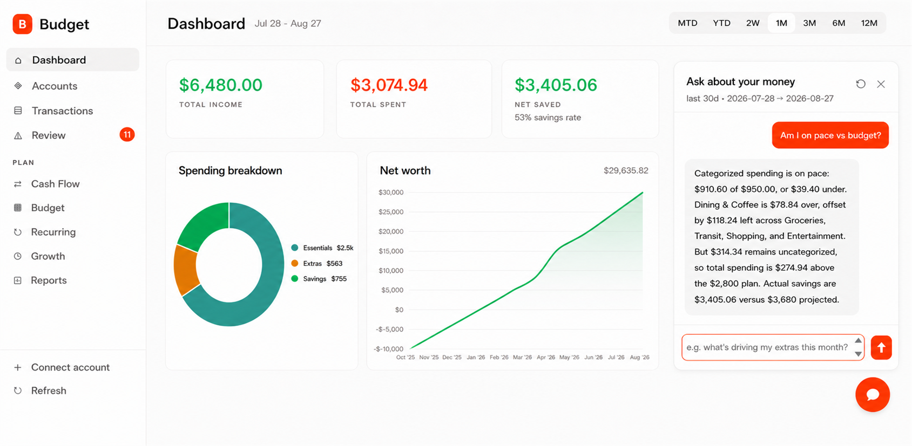
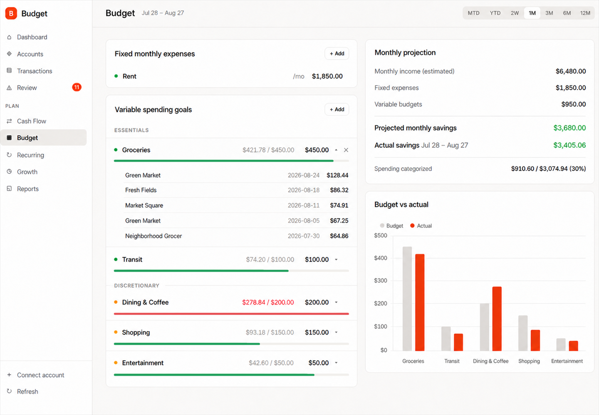

# Budget

This is a locally hosted budgeting app for people who want a customizable platform to
view of real bank activity. It links accountsthrough [Plaid](https://plaid.com),
classifies transactions, and tracks spending against the budget you set. Runs entirely
on your own machine: no data leaving your box except the calls to Plaid.


All screenshots use fictional financial data. Setup Health shows an intentionally
under-configured state. Dashboard, Cash Flow, Budget, and chat show the month before
review. Review and Recurring show it after six decisions, with 11 purchases left.

## What it does

- Live balances across checking, savings, and credit cards. Net worth is
  `checking + savings − credit`, with a month-over-month delta.
- Classifies every transaction as essential, extra, savings, or income. Internal
  transfers and credit-card bill payments are netted out, so they do not appear as
  spending.
- Shows cash flow as a Sankey: income on the left, categories on the right.
- Tracks fixed monthly constants and variable categories mapped to Plaid category
  prefixes. Longest-prefix-first matching prevents double counting. Click any populated
  variable category to inspect the transactions behind its actual.
- Detects recurring charges from 12 months of history. See cadence, amount, next expected
  date, and monthly cost.
- Flags discretionary purchases for review. Mark each one Essential, Worth it, or Regret
  it, then see what regretted spending would have compounded to.
- Projects growth toward savings goals and estimates time to target.
- Includes an optional Ask Claude panel for questions against the dashboard's current data
  snapshot.

### Ask Claude

Set `ANTHROPIC_API_KEY` in `.env` and restart the server to enable the embedded chat
panel. Ask about balances, budget targets, transactions in the selected period, or monthly
history. The key stays server-side, but the dashboard snapshot is sent to Anthropic when
you ask a question.



*Example shown with mocked financial data.*

### Expand a budget category

Click any variable budget row with matched transactions to see the merchant, date, and
amount behind its actual.



*Example shown with mocked financial data.*

### Cash flow

Cash-flow buckets use the same calculations as the rest of the dashboard, so the totals
agree.


### The review queue

Not all purchases are equal - two trips to CVS can mean different things: were you
purchasing cold medication or the junk food you are trying to avoid? Choose **Essential**
to promote a purchase out of discretionary spending, **Worth it**, or **Regret it**.
Verdicts persist - the pie, stats, and growth what-if all use them.


*Six decisions are complete: one Essential, two Worth it, and three Regret it. Eleven
remain.*

### Recurring charges

A merchant needs three or more charges at a consistent interval with stable amounts.
Streams quiet for two cycles are marked stopped and excluded from totals.


## Setup

Requires **Node.js 20+** (`better-sqlite3` is a native module and does not build on 18).

```bash
npm install
cp .env.example .env    # then fill in your Plaid credentials
npm start
```

Open <http://localhost:3000> and use **Connect account** to link an account.

`PLAID_ENV=sandbox` works immediately with Plaid's test credentials. Linking real banks
requires production access, which Plaid grants per-account on request.

## Configure your accounts first

Edit **`public/js/config.js`**. Defaults are deliberately empty when a wrong guess would
silently produce wrong numbers, so a fresh clone is under-configured on purpose. The
dashboard reports what is missing.


*This is an intentionally under-configured example. Its totals differ from the configured
screenshots above.*

Start with these two settings:

- **`RENT_MERCHANTS`**: rent paid by ACH or Zelle usually is not tagged
  `RENT_AND_UTILITIES_RENT` by Plaid, and P2P rules would otherwise skip it. Leave it
  empty and your largest monthly expense can vanish from spending entirely.
- **`INTERNAL_TRANSFER_MEMOS`**: a transfer between your own accounts appears twice, once
  per account. Banks label the two legs differently and there is no standard. Leaving it
  empty is safe but lossy: "Transferred to savings" reads zero. Getting `checkingSide`
  and `savingsSide` **backwards is not safe**. You would count the wrong leg.

Review `ESSENTIAL_CATS` (which Plaid categories you consider needs),
`SAVINGS_MERCHANTS` (your brokerages), `ESSENTIAL_MERCHANTS` (your insurer), and
`ONE_OFF_INCOME_MIN`. Rules that apply to everyone live in `public/js/rules.js` and
should rarely need editing.

## Data and privacy

Transactions are fetched from Plaid on demand and held in the browser. Only budget
definitions, savings goals, balance snapshots, and spending verdicts persist in the local
SQLite file (`budget.db`).

- Keep `budget.db`, `.env`, and `.tokens.json` gitignored. `.tokens.json` holds Plaid
  *access tokens*, long-lived read credentials for linked accounts. If one leaks, revoke
  it with Plaid's `/item/remove`; rotating your API secret alone is not enough.
- There is no authentication. Three controls make that workable locally:
  1. **No CORS grant.** The dashboard is same-origin, so it does not need one. Without it,
     other sites you visit cannot read data from localhost.
  2. **A `Host` allowlist.** Binding to loopback does not stop DNS rebinding, where an
     attacker's page repoints its own domain at `127.0.0.1` and the browser then treats
     requests as same-origin.
  3. **A loopback-only bind.** The server is not reachable from your network. No phone or
     LAN access is deliberate.

  Do not put this behind a public listener without adding real authentication.
- The Claude chat panel sends data to Anthropic. Each question sends the dashboard's
  computed snapshot: balances, budget, and transactions in the selected period. Leave
  `ANTHROPIC_API_KEY` unset to disable the panel.

## Architecture

`server.js` is an Express API over Plaid and SQLite. `db.js` owns the schema. The frontend
is `index.html` (markup only) over ES modules in `public/js/`, served at `/static`. There
is no build step. The browser loads the modules directly.

```
public/js/
  config.js      everything you must review: rent payees, transfer memos, brokerages
  rules.js       universal rules: Plaid taxonomy, national merchant brands
  classify.js    the classification ladder — order is load-bearing
  health.js      the setup checks behind the banner above
  nav.js         sidebar routing; each page redraws its charts on entry
  …one module per page and per concern
```

[`CLAUDE.md`](CLAUDE.md) has the detailed walkthrough: classification order, balance math,
budget matching, and caching rules.

## Tests

```bash
npm test
```

Tests use Node's built-in runner with no framework or devDependencies. Coverage focuses on
order-dependent money logic, where a silent reordering can produce convincing but wrong
numbers. Rent must outrank the P2P skip or Zelle rent disappears. Rideshare must outrank
`ESSENTIAL_CATS` or every Uber becomes a necessity.

Tests that depend on `config.js` read configured values rather than hardcoding them. When a
list is empty, they skip with a reason, so the suite gets stronger once you configure it.

## Status

This is a personal project published because the classification approach might be useful to
someone else. Adjust `config.js` before the numbers reconcile against your statements. The
setup banner tells you when they will not.

## Notes

- Technical note: the opening claim that data leaves the machine only for Plaid conflicts
  with the optional Claude panel described above. That panel sends a dashboard snapshot to
  Anthropic when enabled.
